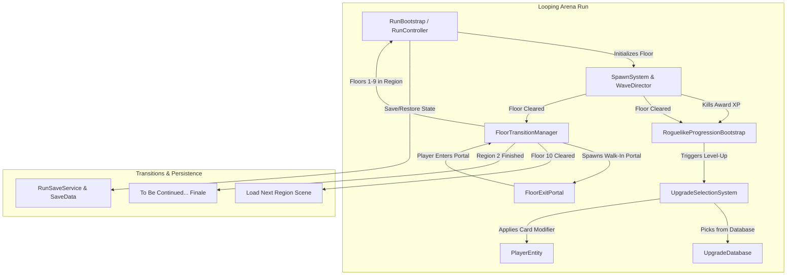

# 3D Roguelike Hack 'n' Slash - System Architecture & User Guide

Welcome to the **3D Roguelike Hack 'n' Slash** architecture and operations guide. This document explains how all major subsystems work together, how to play and test the game, and how to create new content (upgrades, enemies, regions, and progression tuning).

---

## Table of Contents
1. [Architecture Overview](#1-architecture-overview)
2. [Quick Start: Playing & Testing](#2-quick-start-playing--testing)
3. [Subsystems Deep Dive](#3-subsystems-deep-dive)
   - [A. Combat & Player Entity](#a-combat--player-entity)
   - [B. Stat Modifiers & Upgrades](#b-stat-modifiers--upgrades)
   - [C. Upgrade Database](#c-upgrade-database)
   - [D. Progression & Leveling](#d-progression--leveling)
   - [E. Enemy Spawning & Wave Director](#e-enemy-spawning--wave-director)
   - [F. Regions, Floors & Portals](#f-regions-floors--portals)
   - [G. Persistence & Game Over Flow](#g-persistence--game-over-flow)
4. [Step-by-Step Content Creation Recipes](#4-step-by-step-content-creation-recipes)
   - [Recipe 1: Creating a New Upgrade](#recipe-1-creating-a-new-upgrade)
   - [Recipe 2: Creating a New Enemy Archetype](#recipe-2-creating-a-new-enemy-archetype)
   - [Recipe 3: Adding or Modifying Regions & Scenes](#recipe-3-adding-or-modifying-regions--scenes)
5. [Automated Verification & Diagnostics](#5-automated-verification--diagnostics)

---

## 1. Architecture Overview



---

## 2. Quick Start: Playing & Testing

### Option A: Direct Scene Play (TestingScene)
1. Open `Assets/Scenes/TestingScene.unity` in Unity.
2. Press **Play**.
3. **Auto-Bootstrapping**: Even if the scene does not have manual bootstrap components placed, the system automatically initializes:
   - `RunBootstrap` & `RunController` (Floor 1, Region 1).
   - `RoguelikeProgressionBootstrap` (XP, Leveling, and HUD synchronization).
   - `PlayerUiBootstrap` (Health bar, XP bar, Level badge, Floor counter, Upgrade selection overlay).
   - `FloorTransitionManager` & `FloorExitPortal`.

### Option B: Full Campaign Play (MainMenu)
1. Open `Assets/Scenes/MainMenu.unity`.
2. Press **Play** and click **Start Run**.
3. You will embark on Region 1, loop through 10 rounds, step into the exit portal to transition to Region 2, and complete the finale.

### Controls
| Action | Input | Description |
| :--- | :--- | :--- |
| **Move** | `W / A / S / D` | Move character in 3D space |
| **Attack** | `Left Mouse Button` | Combo attacks (chains up to 5 hits) |
| **Heavy Attack** | `Hold Left Mouse / Right Mouse` | Devastating sweeping strike |
| **Dash / Evade** | `Space` | Quick dodge roll |
| **Pause** | `Escape` | Opens pause menu |
| **Select Upgrade** | `1`, `2`, `3` or Mouse Click | Highlight offered upgrade card |
| **Confirm Upgrade**| `Space` or Click Selected Card | Lock in upgrade and resume combat |

---

## 3. Subsystems Deep Dive

### A. Combat & Player Entity
- **Class**: `PlayerEntity` implements `IEntity`.
- **Core Attributes**:
  - `Health` / `MaxHealth`: Player vitality.
  - `Defense`: Flat and percentage mitigation against incoming damage.
  - `AttackDamage`: Flat base and percentage bonuses applied to attacks.
  - `AttackSpeed`: Modifies attack animation playback speed and combo recovery.
  - `CritChance` (0.0 – 1.0): Probability of critical strike.
  - `CritMultiplier` (Base 1.5×): Damage multiplier when critical strikes proc.
  - `WeaponLength` & `WeaponSize`: Dynamically scales the weapon's collider and visual transform.
- **Combat Pipeline**: Attacks emit hitboxes managed by `HitboxDamageHelper`, applying damage, critical multipliers, and invoking `OnDamageTaken` on the targeted entity.

### B. Stat Modifiers & Upgrades
Upgrades implement `IStatModifier` and come in three primary categories:
1. **Passive Modifiers (`PassiveEffect`)**:
   - Provide unconditional attribute boosts (e.g. `+15% Damage`, `+50 Max HP`, `+0.5 Weapon Length`).
   - Serialization: Polarity (Positive/Negative), Target Stat, Modifier Type (Flat/Percent), Chance (Drop Weight).
2. **Conditional Modifiers (`ConditionalEffect`)**:
   - Dynamic buffs evaluated based on runtime entity state:
     - **Low HP / Berserk**: Active when Health is below a threshold (e.g. `HP < 30%, +40% Damage`).
     - **High HP / Pristine**: Active when Health is high (e.g. `HP > 90%, +40% Damage`).
     - **Stat Thresholds**: Active when a stat reaches a minimum (e.g. `Defense > 10, +25% Damage`).
3. **Cursed Modifiers**:
   - High-risk tradeoffs with negative polarity (e.g. `Glass Constitution (-25 Max HP)`).

### C. Upgrade Database
- **Asset**: `Assets/Resources/UpgradeDatabase.asset`
- **Class**: `UpgradeDatabase.cs`
- Holds references to all **60 stat modifier ScriptableObjects** in `Assets/Scripts/Roguelike/StatModifiers/`.
- **Key Features**:
  - **Weighted Random Rolls**: Uses `_chance` property of each modifier to weight selections.
  - **Deduplication**: Excludes already-offered upgrades in the current draft.
  - **Editor Sync Tool**: Under the Unity top menu bar: **`Roguelike > Populate Upgrade Database`**. Re-running this automatically refreshes all modifiers from the project without needing manual Inspector drag-and-drop.

### D. Progression & Leveling
- **Classes**: `ProgressionSystem.cs`, `UpgradeSelectionSystem.cs`, `RoguelikeProgressionBootstrap.cs`.
- **XP Formula**:
  - Kill an enemy: `+25 XP`.
  - Clear a room: `+100 XP`.
  - Required XP scales per level: `BaseXp * (GrowthFactor ^ (Level - 1))`.
- **Level-Up Flow**:
  1. Progression hits threshold $\rightarrow$ Level increases.
  2. Gameplay freezes (`Time.timeScale = 0`), cursor unlocks.
  3. `UpgradeSelectionSystem` rolls 3 distinct cards from `UpgradeDatabase`.
  4. Cards display formatted title, description, value text, and icon (`sword`, `heart`, `boots`).
  5. Player picks a card $\rightarrow$ applied to `PlayerEntity` $\rightarrow$ time unfreezes.

### E. Enemy Spawning & Wave Director
- **Classes**: `SpawnSystem.cs`, `WaveDirector.cs`, `EnemyArchetype.cs`, `SpawnTable.cs`.
- **Budget-Driven Waves**:
  - Each floor has an enemy budget that scales with the floor number.
  - Enemies are drafted from `ProductionSpawnTable.asset` based on their spawn weight and cost.
  - Spawns can occur across multiple waves (e.g., initial wave $\rightarrow$ wave 2 triggers after kills).
- **Enemy Archetypes**:
  - `ComboWarrior`: Aggressive melee grunt that executes multi-hit combos.
  - `ComboBrute`: Heavy bruiser with higher health and sweeping strikes.
  - `ExplodingScout`: Fast, fragile scout that rushes the player.
  - `GreaterExploder`: Heavy explosive enemy that detonates in a large area upon death.
- **Spawn Zones (`SpawnZone.cs`)**:
  - Supports both **Center-Size** (box) and **Two-Point** (world-space bounding box) modes.
  - Placement validator enforces obstacle clearance, NavMesh sampling, player distance minimums, and inter-enemy spacing.

### F. Regions, Floors & Portals
- **Classes**: `RunRegionSettings.cs`, `RegionConfig.cs`, `FloorTransitionManager.cs`, `FloorExitPortal.cs`.
- **Structure**:
  - **Region 1**: Default 10 looping arena rounds in `TestingScene` (or custom Region 1 scene).
  - **Region 2**: 10 rounds in Region 2 scene with scaled enemy budgets and archetype mixes.
  - **Walk-In Portal**:
    - When all enemies in a floor are defeated, `FloorExitPortal` activates.
    - Emits a visual light pillar/beacon and plays a portal chime sound.
    - Walking into the portal automatically triggers the floor transition.
- **Scene Transitions**:
  - When completing the final floor of Region 1 (Floor 10), `FloorTransitionManager` saves progression and loads the configured Region 2 scene.
  - When completing Region 2 (Floor 20), the game triggers the cinematic **"To be continued..."** black screen finale.

### G. Persistence & Game Over Flow
- **Classes**: `RunSaveService.cs`, `SaveData.cs`, `GameOverFlow.cs`.
- **Cross-Scene & Session Persistence**:
  - `SaveData.json` stores: `playerLevel`, `currentXp`, `pendingUpgrades`, `currentHealth`, `appliedUpgradeIds`, `currentFloor`, `currentRegion`.
  - When transitioning scenes or restarting, `RoguelikeProgressionBootstrap` restores player stats, health, and re-applies all collected upgrade cards.
- **Death & Retry**:
  - Player health reaches 0 $\rightarrow$ `GameOverFlow` pauses the game and displays summary (Floors Cleared, Enemies Slain, Run Duration).
  - Clicking **Retry** deletes the run save file and starts a fresh run at Floor 1.

---

## 4. Step-by-Step Content Creation Recipes

### Recipe 1: Creating a New Upgrade
1. In the Project window, navigate to `Assets/Scripts/Roguelike/StatModifiers/`.
2. Right-click $\rightarrow$ **Create > Roguelike > Stat Modifier**:
   - Choose **Passive Modifier** for flat/percent permanent boosts.
   - Choose **Conditional Modifier** for conditional/threshold buffs.
3. Configure fields in the Inspector:
   - **Target Stat**: e.g., `AttackDamage`, `AttackSpeed`, `MaxHealth`, `Defense`, `CritChance`, etc.
   - **Modifier Polarity**: `Positive` (buff) or `Negative` (curse).
   - **Modifier Type**: `Flat` (+5 Damage) or `Percentage` (+20% Damage).
   - **Chance**: Spawn drop weight (e.g., `1.0` standard, `0.2` rare).
4. Synchronize the Database:
   - In the Unity top menu bar, click **`Roguelike > Populate Upgrade Database`**.
   - Your new upgrade is now automatically drafted during level-up cards!

### Recipe 2: Creating a New Enemy Archetype
1. Create enemy prefab with `EnemyController` and `NavMeshAgent`.
2. In Project window, navigate to `Assets/Data/Roguelike/Spawning/Production/`.
3. Right-click $\rightarrow$ **Create > Roguelike > Spawning > Enemy Archetype**:
   - Assign the `Prefab`.
   - Set `Spawn Cost` (how much budget this unit consumes).
   - Set `Weight` (likelihood of being selected).
   - Set `Minimum Floor` (e.g. 3 to appear only on later floors).
4. Add the new Archetype asset to `Assets/Resources/ProductionSpawnTable.asset` entries list.

### Recipe 3: Adding or Modifying Regions & Scenes
1. Select `Assets/Resources/RunRegionSettings.asset` in the Inspector.
2. Under **Regions**:
   - **Element 0 (Region 1)**:
     - `Region Index`: 0
     - `Region Name`: "The Forgotten Ruins"
     - `Scene Name`: "TestingScene" (or your custom scene name)
     - `Floors Per Region`: 10
   - **Element 1 (Region 2)**:
     - `Region Index`: 1
     - `Region Name`: "The Infernal Depths"
     - `Scene Name`: "Demonstration" (or your custom scene name)
     - `Floors Per Region`: 10
3. Ensure both scene names are added to **File > Build Settings > Scenes in Build**.

---

## 5. Automated Verification & Diagnostics

To verify code integrity, tests, and compilation outside of the Unity Editor, run the following commands in the project directory:

```bash
# 1. Compile C# assemblies
dotnet build Assembly-CSharp.csproj

# 2. Run full automated integration test suite (654 checks)
dotnet run --project tools/spawn-integration-test
```

All 654 automated checks test:
- Save and restore cross-scene persistence
- Two-point spawn zone geometry & obstacle safety margins
- Wave director budget allocations and multi-wave triggers
- Upgrade selection rules & idempotency
- Game Over lifecycle, pause states, and clean retry flows
- Floor transitions, walk-in portal activations, and region finales
